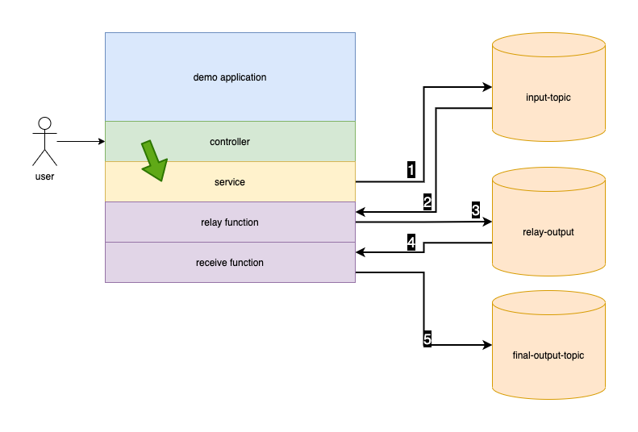

# spring cloud stream demo
The purpose of the demo is to show how easy Spring Cloud Stream Binders make 
it for us to swap out middleware.



## docker
To spin up the environments choose either rabbit or kafka

For Rabbitmq:
```shell
$ docker compose -f docker-compose-rabbitmq.yml up
```

For Kafka:
```shell
$ docker compose -f docker-compose-kafka.yml up
```

## build.gradle
In order the middleware that you choose you need to specify it in your 
build also. 

For Rabbitmq:
```groovy
implementation 'org.springframework.cloud:spring-cloud-stream-binder-rabbit'
```

For Kafka:
```groovy
implementation 'org.springframework.cloud:spring-cloud-stream-binder-kafka'
```

## Excercising the app
In order to produce a message you need to use the controller

```shell
$ curl -X POST -H "Content-type: application/json" http://localhost:8888/sendMessage/somePayload
```